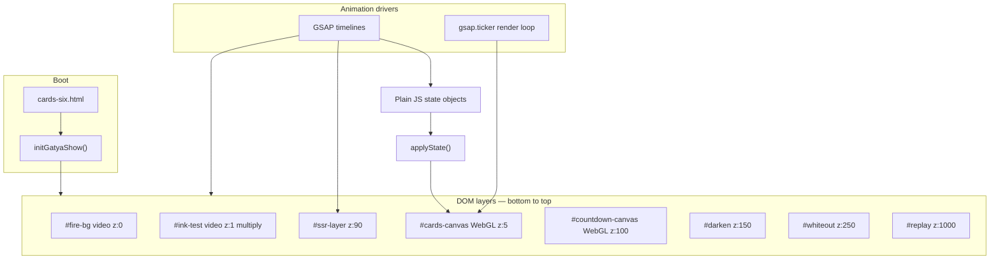

# 03 — Architecture

[← Folder structure](./02-folder-structure.md) · [Index](./README.md) · [Next: Tech stack →](./04-tech-stack.md)

---

## High-level picture

The show is a **stack of composited layers** driven by **GSAP timelines**. Two separate Three.js renderers exist (hex cards + countdown text); the SSR card uses a third tiny WebGL canvas inside a CSS-3D-transformed DOM element.



---

## Single-page integration

Historically, hex cards and countdown lived on **separate HTML pages** linked by `location.href`. That caused:

- Fire video restart / flash
- SSR card re-drop
- Audio discontinuity

**Current architecture:** one page, phase changes = **opacity + canvas visibility** only.

| Phase transition | Mechanism |
|------------------|-----------|
| Hex → ink/countdown | `showInkLayer()` — `#cards-canvas` opacity 0, `#countdown-canvas` opacity 1 |
| Digit → darken | GSAP on `#darken`; hide countdown canvas; pause fire |
| Darken → white SSR | `#white-ssr` video + SSR card fade in |
| End → replay | `playShow()` resets all timelines and layer opacities |

---

## Layer stack (production)

| z-index | Element | Technology | Visible when |
|---------|---------|------------|--------------|
| 0 | `#fire-bg` | `<video loop>` | Start → darken (then hidden/paused) |
| 1 | `#ink-test` | `<video>` + `mix-blend-mode: multiply` | Each countdown digit + LAST |
| 5 | `#cards-canvas` | Three.js WebGL, **alpha** | Hex phase only |
| 90 | `#ssr-layer` | DOM (`perspective`) + nested canvas | SSR drop → finale |
| 100 | `#countdown-canvas` | Three.js WebGL | Ink phase → darken |
| 150 | `#darken` | Black div opacity | Finale |
| 250 | `#whiteout` | White div opacity | End |
| 1000 | `#replay` | Button | Always (after init) |

Stage aspect ratio: **1080 × 1920** (portrait mobile).

---

## Module responsibilities

```
cards-six.html
    │
    ├── import gatya-unified.mjs
    │       ├── import ref-match-config.mjs    (constants)
    │       ├── import countdown-three-overlay.mjs
    │       └── import se.mjs
    │
    └── import compare-panels.mjs              (UI copy only)
```

### `initGatyaShow()` lifecycle

1. **Setup** — create Three.js renderer/scene/camera for hex cards; load 6 card PNGs; build cylinder hierarchy.
2. **SSR** — load `ssr card.png`; init orthographic mini-renderer on `#ssr-card-canvas`.
3. **Countdown** — await `initCountdownOverlay()` (font load, text meshes, own scene).
4. **Fire video** — ensure metadata loaded; start loop.
5. **Return API** — `{ playShow, seekCardsTime, measureCardsScreenBBox, … }`.
6. **First play** — `playShow('after')` from HTML boot (or on replay click).

---

## Animation state pattern

GSAP does **not** tween Three.js objects directly for the hex cylinder. It tweens plain objects:

```javascript
const anim = { x, y, z, rotX, rotZ, rotYOff, scaleMul, opacity };
const spin = { rate, y };
const gather = { t };           // 1 → 0 during slide (spread → formed)
const cardUpright = { t };      // 0 → 1 during stand+hold+rise
const hexGap = { scale };       // narrows as cards verticalize
```

Each frame (via `gsap.ticker`):

```
tickCardsSpin(dt)
applyState()          → writes anim/spin into Three.js groups
applyCardHexGather()  → per-card positions on hex ring
renderer.render()
```

This pattern keeps timing in GSAP and keeps Three.js as a **display layer** — familiar if you've used GSAP with React state or DOM.

---

## Compare mode (before / after)

The HTML exposes a **before / after** toggle. It calls `playShow(mode)` which:

1. Loads spatial profile from `REF_MATCH` (after) or `BEFORE_MATCH` (before)
2. Sets `gatherMode` — changes gather algorithm (diagonal vs radial)
3. Rebuilds `buildCardsTimeline()` from scratch

Side panels document the diff (`compare-panels.mjs`). Use this when validating hex changes against the previous tuning generation.

---

## Coordinate systems

| Context | Units |
|---------|-------|
| Hex scene | Three.js world units; camera at ~z=6 looking at origin |
| SSR DOM | Pixels-ish via GSAP (`x: -6`, `y: 14`, `z: -28`, degrees for rotations) |
| Screen bbox measurement | Normalized 0–1 (`cx`, `cy`, `w`, `h`) via `measureCardsScreenBBox()` |
| Reference keyframes | Seconds from show start (e.g. 0.37 = gather complete) |

---

## Related reading

- [Tech stack](./04-tech-stack.md) — which library owns each concern
- [Show timeline](./05-show-timeline.md) — when each layer activates
- [Hex cylinder](./06-hex-cylinder.md) — 3D group hierarchy

[Next: Tech stack →](./04-tech-stack.md)
