# 05 — Show timeline

[← Tech stack](./04-tech-stack.md) · [Index](./README.md) · [Next: Hex cylinder →](./06-hex-cylinder.md)

---

## Time origin

**t = 0** when `playShow()` runs (page load or replay).

Two overlapping “clocks” exist after the hex phase:

1. **Hex master timeline** — `buildCardsTimeline()` in `gatya-unified.mjs`
2. **Post-show sequence** — callbacks scheduled from hex timeline + countdown module

---

## Phase overview

```
0s        fire only
0.15s     hex cards appear → gather → stand → hold → rise → exit (~1.97s total hex)
~1.14s    SSR drop starts (crosses rising hex)
~1.64s    SSR lands → bounce
~1.76s    ink phase (layer switch; countdown armed)
~2.86s    countdown 5→1→LAST starts
…         LAST → freeze ink → darken → white SSR → whiteout
```

Exact post-SSR times depend on `POST_SHOW_AFTER` constants (below).

---

## Segment A — Fire only

| Start | Duration | Content |
|-------|----------|---------|
| 0 | `CARD_INTRO_DELAY` (0.15s) | `#fire-bg` only; cards invisible |

---

## Segment B — Hex cylinder

**Total duration:** `REF_TOTAL` ≈ **1.97s**  
(`0.15 + 0.22 + 0.12 + 0.55 + 0.38 + 0.50`)

Constants from [`ref-match-config.mjs`](../src/ref-match-config.mjs):

| Label | Offset from t=0 | Duration | Phase name |
|-------|-----------------|----------|------------|
| `d` | 0.15 | — | Cards become visible |
| slide | 0.15 | 0.22s | Diagonal gather, tilt to FORM, motion blur |
| `t1` | 0.37 | — | Slide end / stand start |
| stand | 0.37 | 0.12s | Rotate to standing pose `ROT` |
| `t2` | 0.49 | — | Stand end / hold start |
| hold | 0.49 | 0.55s | Drift, scale, z depth, card upright 0→1 |
| `t3` | 1.04 | — | Hold end / **rise start** |
| rise | 1.04 | 0.38s | Cylinder verticalizes, moves to `RISE.mid`, fade |
| `t4` | 1.42 | — | Rise end / exit start |
| exit | 1.42 | 0.50s | Move to `RISE.exit`, opacity 0, blur |
| end | 1.92 | — | `resetCardsShow()` |

### Reference keyframes (for comparison)

| Time (s) | Phase | What to check |
|----------|-------|---------------|
| 0.15 | gather-start | Cards appear |
| 0.37 | gather-end | Hex ring complete |
| 0.50 | formed | Stable cup, center-ish |
| 0.62 | hold | Slight drift / scale |
| 1.04 | pre-rise | Rise begins |
| 1.25 | rise-mid | Verticalizing, moving up |
| 1.42 | rise-end | Rise complete |
| 1.92 | exit-end | Gone |

Use `/ref` viewer to scrub these times against `reference-r2-24fps.mp4`.

---

## Segment C — SSR drop

Scheduled on hex timeline at:

```
ssrAt = t3 + SSR_CROSS_RISE_OFFSET
      = 1.04 + 0.1
      ≈ 1.14s
```

| Property | Value |
|----------|-------|
| Duration | `SSR_DROP_DUR` = 0.5s |
| Easing | `power3.in` |
| Implementation | GSAP on `#ssr-card-wrap` + shader opacity fade |

SSR **crosses** the still-rising hex cylinder (intentional composition).

---

## Segment D — Ink phase (layer switch)

Scheduled at:

```
inkAt = ssrAt + SSR_DROP_DUR + post.inkAfterSsrLand
      ≈ 1.14 + 0.5 + 0.12
      ≈ 1.76s
```

`startInkPhase()`:

- Hides `#cards-canvas`, shows `#countdown-canvas`
- Fire + SSR stay visible
- Ink video hidden until first digit
- Arms countdown after `post.countdownDelay` (1.1s)

---

## Segment E — Countdown

Starts ≈ **1.76 + 1.1 = 2.86s** after show start.

| Step | Duration (approx) | Notes |
|------|-------------------|-------|
| Digit 5 | 1.0s step window | appear 0.42 + hold 0.4 + exit 0.2 |
| Digits 4–1 | same pattern | Each triggers ink + taiko SE |
| LAST | appear + hold | **No exit** — stays on screen |

Countdown module: `STEP = TOTAL/6` where `TOTAL = 6` seconds for full 5→LAST sequence.

Callbacks into main show:

- `onDigitStart(char)` — sync ink video, play taiko
- `onLastShown()` — schedule ink freeze, darken, finale

---

## Segment F — Finale (`POST_SHOW_AFTER`)

Current production timings in `gatya-unified.mjs`:

| Constant | Value | Meaning |
|----------|-------|---------|
| `lastInkFreeze` | 0.5s | After LAST, pause ink on frame |
| `lastToDarken` | 1.0s | Delay before blackout starts |
| `darkenDur` | 2.0s | Fade to black |
| `fireFadeOut` | 2.0s | Fire SE fade (parallel) |
| `whiteRevealDur` | 0.45s | White SSR + card fade in |
| `finaleHold` | 2.0s | Hold on white SSR |
| `whiteoutDur` | 0.9s | Fade to white |

Sequence on darken:

1. `#darken` opacity → 1; fire video hidden + paused
2. Countdown canvas hidden; ink hidden
3. `#white-ssr` video plays; SSR card fades in with bounce
4. `#darken` opacity → 0 (reveal white scene)
5. Hold, then `#whiteout` opacity → 1

---

## Timeline diagram

```mermaid
gantt
  title Show phases (approximate)
  dateFormat X
  axisFormat %Ss

  section Background
  Fire video           :0, 8000

  section Hex
  Intro delay          :0, 150
  Slide gather         :150, 370
  Stand                :370, 490
  Hold                 :490, 1040
  Rise                 :1040, 1420
  Exit                 :1420, 1920

  section SSR
  SSR drop             :1140, 1640
  Bounce               :1640, 8000

  section Post
  Ink layer switch     :1760, 2860
  Countdown            :2860, 5860
  Darken finale        :5860, 8000
```



*(Bar lengths after countdown are illustrative — exact LAST→darken depends on countdown progress.)*

---

## What triggers what (code map)

| Time / event | Function | File |
|--------------|----------|------|
| `playShow()` | Reset + `buildCardsTimeline()` | `gatya-unified.mjs` |
| `t3` | `se.play('rise')` | `gatya-unified.mjs` |
| `ssrAt` | `dropSsrCard()` | `gatya-unified.mjs` |
| `inkAt` | `startInkPhase()` | `gatya-unified.mjs` |
| countdown delay | `countdownCtrl.play()` | via `startInkPhase` |
| each digit | `onDigitStart` | callback in init |
| LAST | `onLastShown` | schedules darken GSAP chain |
| replay click | `playShow()` | resets all |

---

## before vs after timing

The **before** compare mode uses `POST_SHOW_BEFORE` with longer gaps (legacy pacing). Hex motion also differs via `BEFORE_MATCH` profile. Only **after** matches current production reference tuning.

[Next: Hex cylinder →](./06-hex-cylinder.md)
