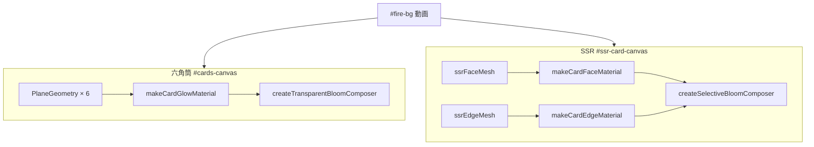

# カード縁グロー実装メモ（現行）

最終更新: 2026-06-28

PNG アルファ境界に沿った**黄色ネオン縁グロー**（`#ffdd22`）を、炎動画 `#fire-bg` の上に透明合成する実装の記録。

---

## ゴール

| 要件 | 内容 |
|------|------|
| 縁のみ | PNG シルエット外周にネオン。カード面は通常表示 |
| 透明 | キャンバス外は alpha 0。炎が見える |
| スリーブ禁止 | 矩形枠・DOM オーバーレイ・`LineSegments` 外枠は使わない |
| 六角筒 / SSR | 見た目は揃えるが、**アーキテクチャは SSR のみ分離** |

---

## 全体構成



| 対象 | キャンバス | メッシュ | シェーダー | ポストプロセス |
|------|-----------|---------|-----------|---------------|
| 六角筒 6 枚 | `#cards-canvas` | 1 枚 / カード | `makeCardGlowMaterial` | `hexBloom`（シーン全体） |
| SSR カード | `#ssr-card-canvas` | **face + edge** 2 枚 | `makeCardFaceMaterial` / `makeCardEdgeMaterial` | `ssrBloom`（**edge のみ** bloom） |

---

## 関連ファイル

| ファイル | 役割 |
|----------|------|
| [`src/gatya-unified.mjs`](../../src/gatya-unified.mjs) | シェーダー 3 種、FX 定数、SSR 二重シーン、描画ループ |
| [`src/card-bloom-composer.mjs`](../../src/card-bloom-composer.mjs) | `UnrealBloomPass` + アルファ保持ミックス |
| [`cards-six.html`](../../cards-six.html) | `ASSET_V` キャッシュバスト |
| [`.cursor/commands/hex-cylinder-glow.md`](../../.cursor/commands/hex-cylinder-glow.md) | 六角筒グロー調整用スラッシュコマンド |
| [`.cursor/commands/ssr-card-glow.md`](../../.cursor/commands/ssr-card-glow.md) | SSR グロー調整用スラッシュコマンド |

---

## 六角筒（6 枚カード）

### 描画

- `PlaneGeometry` + カスタム `ShaderMaterial`（`makeCardGlowMaterial`）
- `hexBloom.render()` で毎フレーム描画（`cardsFrame`）
- レンダラー: `alpha: true`, `setClearColor(0,0)`

### シェーダー（`makeCardGlowMaterial`）

1 パスで **表示色** と **bloom 用 HDR** を同時出力。

| 処理 | 内容 |
|------|------|
| 縁検出 | `dFdx` / `dFdy` on alpha → `alphaBoundary()` |
| 外側ハロー | `outerHalo()` — アルファの多段ガウシアンぼかし（`max` ではなく加重和） |
| カード上 | 面テクスチャ + sheen / `surfaceGlow`、`bloomInteriorCap` で明るさ上限 |
| 縁リム | `rimStrength` で薄い黄色 |
| bloom 入力 | `bloomEmit = glowColor * edgeTight * bloomStrength` |
| フリンジ | PNG 外の透明ピクセルに `glowColor * halo * haloStrength` |

### ポストプロセス（`createTransparentBloomComposer`）

```
bloomComposer:  RenderPass(全シーン) → UnrealBloomPass
finalComposer:  RenderPass(全シーン) → AlphaMixShader
```

`AlphaMixShader`:

- `base.rgb + bloom.rgb * bloomWeight`
- `bloomWeight` で面内部の bloom 漏れを抑制（`baseLuma` / `base.a` ヒューリスティック）
- alpha は `base.a`（`OutputPass` は使わない — 全面不透明化の原因になる）

---

## SSR カード（face / edge 分離）

### なぜ分離したか

単一メッシュ + 全体 bloom では、**縁の bloom が画面空間でぼけてカード面全体に乗る**（フェイスウォッシュ）か、**面を守ると縁が弱い**というトレードオフがあった。SSR はヒーローカードのため **面と縁を別メッシュ・別 bloom 入力** に分離。

### シーン構成

```javascript
ssrFaceScene  → ssrFaceMesh  (makeCardFaceMaterial)  // bloom 対象外
ssrBloomScene → ssrEdgeMesh  (makeCardEdgeMaterial)  // bloom のみ
```

同一 `PlaneGeometry` を共有。`ssrEdgeMesh.renderOrder = 1`。

### `makeCardFaceMaterial`

- PNG サンプル + `metalStrength` / `surfaceGlow` のみ
- **グロー・フリンジ・bloomEmit なし**
- `discard` if `alpha < 0.04`

### `makeCardEdgeMaterial`

| 領域 | 描画 |
|------|------|
| カード内部 | `edgeTight < 0.15` → **discard**（縁バンドのみ） |
| 縁バンド | `bloomEmit` のみ（on-card の display 黄色は付けない） |
| PNG 外フリンジ | `outerHalo()` + `smoothstep` でソフト alpha |

### ポストプロセス（`createSelectiveBloomComposer`）

```
bloomComposer:  RenderPass(ssrBloomScene) → UnrealBloomPass
finalComposer:  RenderPass(ssrFaceScene)  → SelectiveAlphaMixShader
```

`SelectiveAlphaMixShader`:

```glsl
bloomWeight = 1.0 - smoothstep(0.5, 0.95, base.a);  // 面への bloom 加算を抑制
outAlpha    = max(base.a, bloomLuma * fringeFade);  // bloom.a は使わない（全面 alpha=1 バグ回避）
gl_FragColor = vec4(base.rgb + bloom.rgb * bloomWeight, outAlpha);
```

**注意:** `UnrealBloomPass` の RT は `alpha = 1` 全面になりがち。`max(base.a, bloom.a)` だと透明領域が黒い矩形になるため、**輝度 `bloomLuma` でフリンジ alpha を決める**。

### キャンバス余白（クリップ対策）

`SSR_CANVAS_GLOW_PAD = 0.18` — カメラ frustum と framebuffer をカードより 18% 広くし、縁グロー + bloom がキャンバス端で切れないようにする。`resizeSsrCardCanvas()` で CSS 負の margin を付与し、見た目のカードサイズは維持。

`#ssr-card-wrap { overflow: visible }` でパディング分のはみ出しをクリップしない。

### DOM

- モーション: `#ssr-card-wrap`（GSAP 3D）— 変更なし
- 描画: 子 `#ssr-card-canvas`（WebGL）

---

## 調整用定数（現行値）

### 六角筒 — `CARD_FX` / `CARD_BLOOM`

```javascript
// gatya-unified.mjs
CARD_FX = {
  glowColor: 0xffdd22,
  glowRadius: 14,
  glowFalloff: 1.8,
  haloStrength: 1.2,
  rimStrength: 0.25,
  bloomStrength: 3.6,
  bloomInteriorCap: 0.52,
  metalStrength: 0.0225,
  surfaceGlow: 0.0125,
};
// card-bloom-composer.mjs CARD_BLOOM_DEFAULTS
strength: 0.65, radius: 0.5, threshold: 0.97
```

### SSR — `SSR_FACE_FX` / `SSR_EDGE_FX` / `SSR_EDGE_BLOOM`

```javascript
SSR_FACE_FX = { metalStrength: 0.055, surfaceGlow: 0.028 };

SSR_EDGE_FX = {
  glowColor: 0xffdd22,
  glowRadius: 20,
  glowFalloff: 1.5,
  haloStrength: 1.75,
  bloomStrength: 4.4,
};

SSR_EDGE_BLOOM_DEFAULTS = { strength: 0.88, radius: 0.52, threshold: 0.94 };
SSR_CANVAS_GLOW_PAD = 0.18;
```

### 調整の目安

| 症状 | まず触る定数 |
|------|-------------|
| グローが弱い（SSR） | `SSR_EDGE_BLOOM.strength` → `bloomStrength` → `haloStrength` |
| グローが弱い（hex） | `CARD_BLOOM.strength` → `bloomStrength` → `haloStrength` |
| 面がウォッシュ（hex） | `bloomInteriorCap` ↑ / `threshold` ↑ / `CARD_BLOOM.strength` ↓ |
| 面縁に黄色（SSR） | `SSR_EDGE_BLOOM.radius` ↓（mix の `bloomWeight` は既に面抑制） |
| 縁がキャンバスで切れる（SSR） | `SSR_CANVAS_GLOW_PAD` ↑ |
| 色変更 | 各 `glowColor` を `new THREE.Color(0xRRGGBB)` |

変更後は `cards-six.html` の `ASSET_V` を bump してハードリロード。

---

## やっていないこと / 禁止事項

- `OutputPass`（透明キャンバスが全面不透明になる）
- 矩形スリーブ（CSS `box-shadow`、カード外側の別 Quad 枠など）
- SSR を再び単一メッシュ + 全体 bloom に戻す（フェイスウォッシュ再発）
- ページ遷移による演出切替（`cards-six.html` 統合のまま）

---

## 経緯（簡潔）

1. シェーダーのみの縁グロー → 細いストロークに留まる
2. 単一メッシュ + `UnrealBloomPass` → 見た目は良いが SSR で面ウォッシュ / 透明破壊
3. アルファ保持 dual composer → 黒矩形（`bloom.a` 問題）を修正
4. **SSR face / edge 分離** + selective bloom → 面とネオンを独立制御
5. キャンバス pad + ソフト discard + mix 調整 → 切れ目のないフリンジ

---

## Cursor コマンド

| コマンド | 用途 |
|----------|------|
| `/hex-cylinder-glow` | 六角筒の `CARD_FX` / `CARD_BLOOM` のみ調整 |
| `/ssr-card-glow` | SSR の `SSR_EDGE_FX` / `SSR_EDGE_BLOOM` のみ調整 |
